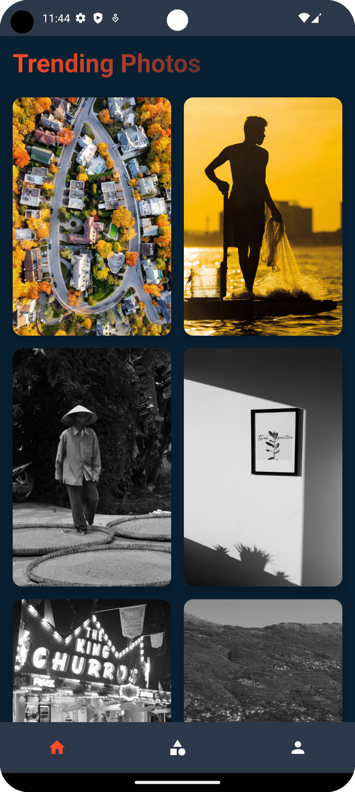
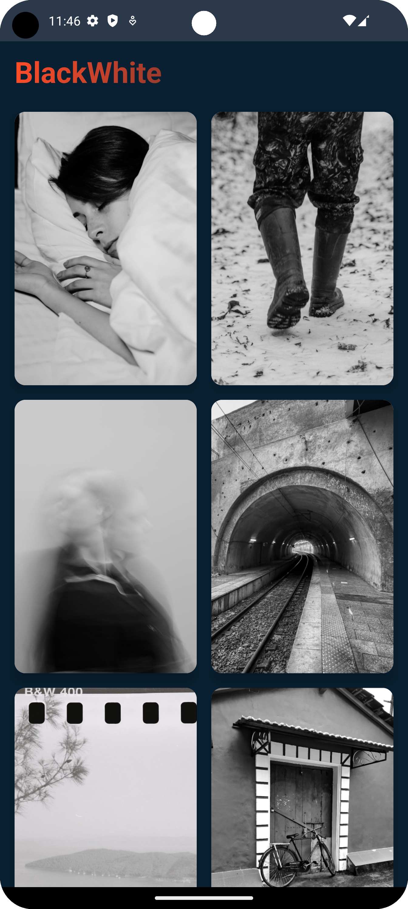
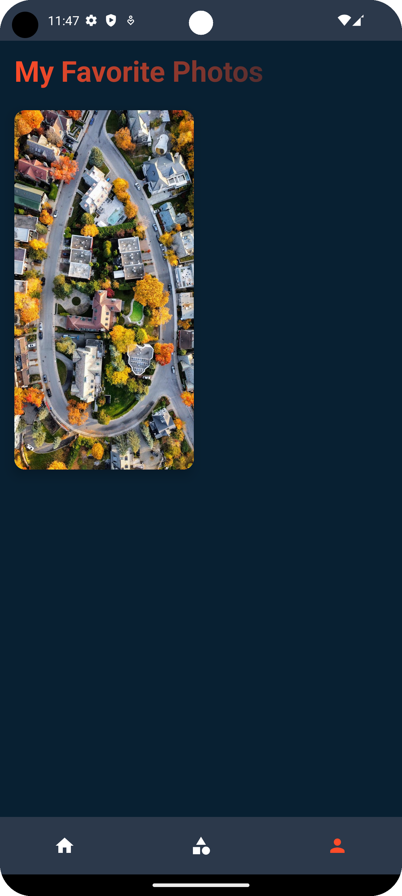
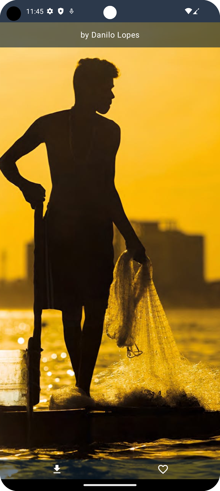

# MyPhotoCollections App

## Overview
MyPhotoCollections App is an Android application that allows users to explore and save photos organized by various trends and categories. Users can browse images, add favorites, and download selected photos directly to their device gallery. This project is built with modern Android development tools and follows clean architecture principles.

## Features
- **Browse Photos**: Discover photos categorized by trending themes or other topics.
- **Favorites**: Mark photos as favorites for easy access.
- **Save to Gallery**: Download selected photos directly to the device's gallery.

## Tech Stack

- **Programming Language**: Kotlin
- **UI Framework**: [Jetpack Compose](https://developer.android.com/compose)
- **Architecture Pattern**: MVVM (Model-View-ViewModel)
- **Image Loading**: [Coil](https://github.com/coil-kt/coil)
- **Network**: [Retrofit2](https://square.github.io/retrofit/)
- **API**: [Pexels API](https://www.pexels.com/api/)

## Getting Started

### Prerequisites
- Android Studio (latest version recommended)
- A Pexels API key (sign up [here](https://www.pexels.com/api/) to obtain your free API key)

### Setup Instructions
1. Clone this repository:
   ```bash
   git clone https://github.com/yourusername/photo-browser-app.git

2. Open the project in Android Studio.
3. In local.properties, add your Pexels API key.
4. Sync the project and run it on an Android device or emulator.

## Libraries Used
- **Jetpack Compose:** To build a modern, reactive UI.
- **Retrofit2:** For making HTTP requests to the PExels API.
- **Coil:** For efficient image loading and caching.
- **Kotlin Coroutines:** For asynchronous programming and managing API calls.

## Screenshots
<p>





</p>